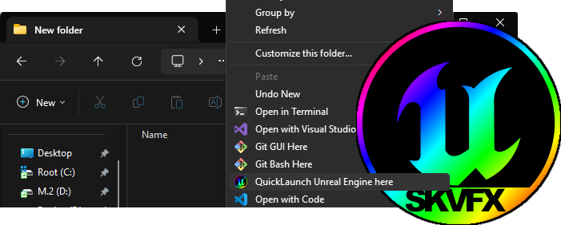

  
  <h1><a href="https://github.com/ScottKirvan/UE_QuickLaunch">ScottKirvan/UE_QuickLaunch</a></h1>
  <h3>A Right-click quick-launch menu for Unreal Engine</h3>
  
<!-- Badges -->

  
  
  
  
  
  
  

<h4>
    <a href="https://github.com/ScottKirvan/UE_QuickLaunch/">View Demo</a>
   · 
    <a href="https://github.com/ScottKirvan/UE_QuickLaunch#readme">Documentation</a>
   · 
    <a href="https://github.com/ScottKirvan/UE_QuickLaunch/issues/">Report Bug</a>
   · 
    <a href="https://github.com/ScottKirvan/UE_QuickLaunch/issues/">Request Feature</a>
  </h4>

**UE_QuickLaunch** is a right-click Unreal Engine project creator/launcher for Windows File Explorer. Right-click on or in a folder, and quickly create a [minimal unreal project](https://gist.github.com/ScottKirvan/84d287bafed19a1e9f0b8764ba21ceb8) (`uproject`) with the same name as the folder. If the project file already exists, just open it.
## Installation and basic usage
Using this is very simple: just download and run [UE_QuickLaunch_installer.msi](https://github.com/ScottKirvan/UE_QuickLaunch/releases). It will ask for permission to install and then run unassisted. After the installer has run, right clicking on a folder or an empty area within File Explorer will show the `QuickLaunch Unreal Engine here` menu item. If you have multiple versions of Unreal Engine installed, a dialog will pop up asking what version of Unreal to use when creating the new project.

## Building from source

If you choose to build this from source, everything you need is packaged up as a **Microsoft Visual Studio Solution** in the `src` folder.  You'll need the Visual Studio **HeatWave** extension to build the installer itself.  See the additional notes in the src [README](src/README.md).

## How to use it

### Normal Usage

From within **File Explorer**

1. create a **New Folder** ([CTRL+SHIFT+N]) -- rename this file to whatever you want your unreal project to be called.
2. double click that folder to enter the new directory.
3. right-click anywhere within that empty directory and select **QuickLaunch Unreal Engine from here**.
If you have more than one version of Unreal installed, you will be prompted to pick which version you wish to start, and Unreal will startup with a blank level open.

No launcher.  No template browser.  No waiting.  Just one click to sweet, sweet engine-time!

### Other Usage Scenarios

- **Click _IN_ FOLDER**:  You can use the right-click context menu by clicking within any folder, or by clicking *on* a folder -- this works in file explorer and on desktop folders.  If a project already exists within the folder, that project will be opened.
- **CLICK _ON_ FOLDER**:  You can right-click and select **QuickLaunch** on a folder name, to create or open an unreal project without having to navigate into the folder -- right-click context works on the left side Navigation Pane in File Explorer too, so you don't need to navigate away from a folder you may already be working in.
- **LAUNCH MULTIPLE PROJECTS**: You can use this to rapidly launch multiple projects at once without having to navigate around looking for them.  For example, say you have multiple projects in their own folders within a subfolder in file explorer, and you need them  all open at once to compare project settings.  Just right click on each folder and launch the projects without having to navigate in and out of folders within File Explorer (and forgetting which project you already launched when it's time to navigate to and launch that third project)
- **QUICKLY GRAB AN ASSET PACK**:  Say you have an asset pack that you need to get something out of, but no unreal project.  Usually the process is go into the Games Launcher (_wait for it to fire up_), navigate to the Library panel (_wait for all the engine versions to get registered_), launch the unreal engine version you want (_wait for the template browser to come up_), navigate from the default template browser screen to the simple blank project you need, select it, use the browse button to navigate to where you want to put it, choose a name -- that name's already used, so you pick another.  Now click launch, wait for unreal to start, and go back to the marketplace asset pack you needed (_assuming you haven't already gotten distracted and forgotten why you even started down this path_). Open it up and select your project... but, that asset pack doesn't support the engine version you launched, so start all over.....  With **QuickLaunch*, you open the epic games launcher to find which asset pack you need, and while you process that purchase from the store, create a folder, right click, and pick your engine ver... oh, wait... what version does the asset pack need?  Check that, right-click, launch Unreal, and as soon is it's fired up, download that asset pack.  :-)  

## Caveats

- This is, of course, **Windows** only since it's a feature of File Explorer.
- In **Windows 11**, the **QuickLaunch** menu item is found by clicking the `Show more options...` menu.  If you wish, you can manually [revert your windows 11's context menu back to the **Legacy Context menu**](https://answers.microsoft.com/en-us/windows/forum/all/restore-old-right-click-context-menu-in-windows-11/a62e797c-eaf3-411b-aeec-e460e6e5a82a)
- In Unreal 5, the default template created by **QuickLaunch** is configured slightly different from a Launcher based blank project.  The differences are outlined below:

In the launcher based version:

> - The **Modeling Tools Editor Mode** plugin is enabled.
>
> - The following Project Settings are  changed:

| Setting                                                                                              | **QuickLaunch** Project      | Launcher Blank Game          |
| ---------------------------------------------------------------------------------------------------- | ---------------------------- | ---------------------------- |
| Project > Target Hardware > **Optimize project settings for**                                        | "Unspecified", "Unspecified" | "Desktop", "Maximum"         |
| Engine > Rendering > Global Illumination > **Dynamic Global Illumination Method**                    | "None"*                      | "Lumen"                      |
| Engine > Rendering > Shadows > **Shadow Map Method**                                                 | "Shadow Maps"                | "VIrtual Shadow Maps (beta)" |
| Engine > Rendering > Default Settings > **Extend default luminance range in Auto Exposure settings** | disabled                     | enabled                      |
| Platforms > Windows > D3D12 Targeted Shader Formats > **SM5**                                        | enabled                      | disabled                     |
| Platforms > Windows > D3D12 Targeted Shader Formats > **SM6**                                        | disabled                     | enabled                      |
| Platforms > Windows Targeted RHIs > **Default RHI**                                                  | "Default"                    | "DirectX 12"                 |

> *enabling Lumen automatically enables several settings that I've omitted from the above list because they match once lumen is enabled.

The **QuickLauncher** project ends up being a just barely lighter starting point then a default Launcher based project, but it's pretty quick and easy to match those settings if needed.  

## How it works

At it's core, this works by adding some registry hooks that launches a simple batch file.  I've written up a short document [here](notes/Registry%20Notes.md).

## Credits
**Copyright (c) (2023):** [Scott Kirvan](https://github.com/ScottKirvan)  - All rights reserved   
*UE_QuickLaunch is licensed under the [MIT License](LICENSE.md).*  

Project Link:  [EU_QuickLaunch](https://github.com/ScottKirvan/EU_QuickLaunch)  
[CHANGELOG](notes/CHANGELOG.md)  
[TODO](notes/TODO.md)
