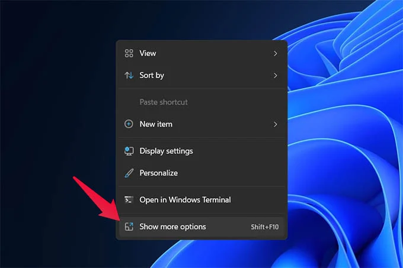

  
  <h1><a href="https://github.com/ScottKirvan/UE_QuickLaunch">ScottKirvan/UE_QuickLaunch</a></h1>
  <h3>A Right-click quick-launch menu for Unreal Engine</h3>
  
<!-- Badges -->

  
  
  
  
  
  
  

<h4>
    <a href="https://github.com/ScottKirvan/UE_QuickLaunch/">View Demo</a>
   · 
    <a href="https://github.com/ScottKirvan/UE_QuickLaunch#readme">Documentation</a>
   · 
    <a href="https://github.com/ScottKirvan/UE_QuickLaunch/issues/">Report Bug</a>
   · 
    <a href="https://github.com/ScottKirvan/UE_QuickLaunch/issues/">Request Feature</a>
  </h4>

**UE_QuickLaunch** is a right-click Unreal Engine project creator/launcher for Windows File Explorer. Right-click on or in a folder, and quickly create a [minimal unreal project](https://gist.github.com/ScottKirvan/84d287bafed19a1e9f0b8764ba21ceb8) (`uproject`) with the same name as the folder. If an unreal project file already exists, QuickLaunch just opens it.
## Installation and basic usage
Download and run [UE_QuickLaunch_installer.msi](https://github.com/ScottKirvan/UE_QuickLaunch/releases).  The installer will ask for permissions to add the registry settings.  After the installer has run, right-clicking on a folder or an empty area within File Explorer will display it's context menu.  Select **QuickLaunch Unreal Engine here** to create a new project and launch Unreal Engine. 

> **Note**
> If you don't see this context menu when you right-click in the folder, it may be because you're using Windows 11.  Windows 11 introduced a new right-click context menu.  Click **Show more options** to bring up the 'Classic' right-click context menu.
>

> 
> If you wish, you can configure Windows 11 to use the _'Classic'_ or _'Legacy'_ version of the right-click context menu by following the instructions [here](https://pureinfotech.com/bring-back-classic-context-menu-windows-11/). 

If you have multiple versions of Unreal Engine installed, a dialog will pop up asking what version of Unreal to launch when creating the new project.

Clicking **OK** creates and launches an Unreal project based on a [Minimal uproject](https://gist.github.com/ScottKirvan/84d287bafed19a1e9f0b8764ba21ceb8) file.  The new project will be identical to creating a new UE4 "Blank" template project from the Launcher.  In UE5 there are some [differences you may want to be aware of](#Caveats).  

If you, like me, always enable the same bunch of plugins and project settings everytime you start a new Unreal project, you can save some manual project initialization steps and use a [Template project](#Template%20project) . 

## Template project

UE_QuickLaunch v2.1 introduces the ability to use a template project rather than just the Minimal uproject.  This gives you the ability to fully customize the type of project created by QuickLaunch.  

To use the template feature, create a `ue_quicklaunch_template` folder in the UE_QuickLaunch installation directory.  The folder's contents will be used as a template to create your new project.  The template's uproject file should be called, `ue_quicklaunch_template.uproject`.  This file will be copied in and renamed to match your project's name.  

> **Warning**
> When creating or using a template project, the contents have to be compatible with the version of Unreal you're launching.  For example, you may be able to create a template level in UE 4.27 and successfully launch it in UE 5.3, but trying to load a UE 5.3 asset into 4.27 will probably not work.  Also, when you create your template, the uproject file will determine which version of Unreal Engine is launched, _unless_ you edited the uproject file and delete the line that specifies the Unreal version.  Using config files and uproject files in different versions may produce some unexpected results, but seems relatively safe.  

## Building from source

If you choose to build this from source, everything you need is packaged up as a **Microsoft Visual Studio Solution** in the `src` folder.  You'll need the Visual Studio **HeatWave** extension to build the installer itself.  See the additional notes in the src [README](src/README.md).

## How to use it

### Normal Usage

From within **File Explorer**

1. create a **New Folder** ([CTRL+SHIFT+N]) -- rename this file to whatever you want your unreal project to be called.
2. double click that folder to enter the new directory.
3. right-click anywhere within that empty directory and select **QuickLaunch Unreal Engine from here**.
If you have more than one version of Unreal installed, you will be prompted to pick which version you wish to start, and Unreal will startup with a blank level open.

No launcher.  No template browser.  No waiting.  Just one click to sweet, sweet engine-time!

### Other Usage Scenarios

- **Click _IN_ A FOLDER**:  You can use the right-click context menu by clicking within any folder, or by clicking *on* a folder -- this works in file explorer and on desktop folders.  If a project already exists within the folder, that project will be opened.
- **CLICK _ON_ A FOLDER**:  You can right-click and select **QuickLaunch** on a folder name, to create or open an unreal project without having to navigate into the folder -- right-click context works on the left side Navigation Pane in File Explorer too, so you don't need to navigate away from a folder you may already be working in.
- **LAUNCH MULTIPLE PROJECTS**: You can use this to rapidly launch multiple projects at once without having to navigate around looking for them.  For example, say you have multiple projects in their own folders within a subfolder in file explorer, and you need them  all open at once to compare project settings.  Just right click on each folder and launch the projects without having to navigate in and out of folders within File Explorer (and forgetting which project you already launched when it's time to navigate to and launch that third project)
- **QUICKLY GRAB AN ASSET PACK**:  Say you see a cool asset on the unreal marketplace, and you just want to "quickly" check it out.  The process is to add the asset to  your library, navigate to the Library panel (_wait for all the engine versions to get registered_), launch Unreal (_wait for the template browser to come up_), navigate from the default template browser screen to a blank project template, select it, use the browse button to navigate to where you want to put it, choose a name -- that name's already used, or you've used a bad character, or etc., so you pick another.  Now click launch, wait for unreal to start. Reopen Launcher and navigate back to the asset in your Library. Open the asset to install it and select your project... but, that asset pack doesn't support the engine version you just launched, so start all over.....  With **QuickLaunch**, you add the asset to your library, and without navigating away from the asset, open File Explorer and launch the correct version of Unreal with QuickLaunch, import the asset, and you're good to go. :-)

## Caveats

- This is, of course, **Windows** only since it's a feature of File Explorer.
- In **Windows 11**, the **QuickLaunch** menu item is found by clicking the **Show more options** menu.  If you wish, you can manually [revert your windows 11's context menu back to the **Legacy Context menu**](https://answers.microsoft.com/en-us/windows/forum/all/restore-old-right-click-context-menu-in-windows-11/a62e797c-eaf3-411b-aeec-e460e6e5a82a)
- In Unreal 5, the default template created by **QuickLaunch** is configured slightly different from a Launcher based blank project.  The differences are outlined below:

In the launcher based version:

> - The **Modeling Tools Editor Mode** plugin is enabled.
>
> - The following Project Settings are  changed:

| Setting                                                                                              | **QuickLaunch** Project      | Launcher Blank Game          |
| ---------------------------------------------------------------------------------------------------- | ---------------------------- | ---------------------------- |
| Project > Target Hardware > **Optimize project settings for**                                        | "Unspecified", "Unspecified" | "Desktop", "Maximum"         |
| Engine > Rendering > Global Illumination > **Dynamic Global Illumination Method**                    | "None"                      | "Lumen"*                      |
| Engine > Rendering > Shadows > **Shadow Map Method**                                                 | "Shadow Maps"                | "VIrtual Shadow Maps (beta)" |
| Engine > Rendering > Default Settings > **Extend default luminance range in Auto Exposure settings** | disabled                     | enabled                      |
| Platforms > Windows > D3D12 Targeted Shader Formats > **SM5**                                        | enabled                      | disabled                     |
| Platforms > Windows > D3D12 Targeted Shader Formats > **SM6**                                        | disabled                     | enabled                      |
| Platforms > Windows Targeted RHIs > **Default RHI**                                                  | "Default"                    | "DirectX 12"                 |

> * *enabling Lumen automatically enables several settings that I've omitted from the above list because they match once lumen is enabled.

The **QuickLauncher** project ends up being a just barely lighter starting point then a default Launcher based project, but it's pretty quick and easy to match those settings if needed.  

## Under the hood

At it's core, QuickLaunch works by simply adding some registry hooks that launch a batch file which stubs in your basic project (or template) and launches Unreal.  

I've written up a short document outlining the registry changes [here](notes/Registry%20Notes.md).

## Credits
**Copyright (c) (2023):** [Scott Kirvan](https://github.com/ScottKirvan)  - All rights reserved   
*UE_QuickLaunch is licensed under the [MIT License](LICENSE.md).*  

Project Link:  [EU_QuickLaunch](https://github.com/ScottKirvan/EU_QuickLaunch)  
[CHANGELOG](notes/CHANGELOG.md)  
[TODO](notes/TODO.md)
